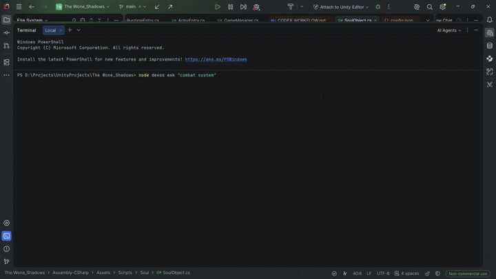

*English | [Tiếng Việt](README.vi.md)*

# DevOS-Lite

A lightweight project-intelligence CLI I built to make AI coding agents 
work faster and cheaper on real codebases — built to support development 
of *The Wone: Shadows* (see `02-TWS-Lite`).

## Demo

]

## Why

AI agents burn tokens re-scanning a codebase for context on every task, 
and tend to drift outside the requested scope. DevOS compiles the project 
into a queryable intelligence layer instead — features, ownership, risk 
profiles — so an agent reads only what's relevant before making a change.

```
Task → DevOS Ask → Relevant Features + Risk Profile → Scoped Change → Verify → Report
```

## What it did

- Cut down how much source an agent needs to read per task
- Kept changes scoped to the actual task, not adjacent systems
- Made small/medium tasks safe to hand off with minimal review

Full workflow protocol: `docs/agent-workflow.md`

## Source

Core engine and CLI internals are kept private (tied to an active 
project). Happy to walk through the code directly — reach out at 
[email:danganhvan40@gmail.com].
```
