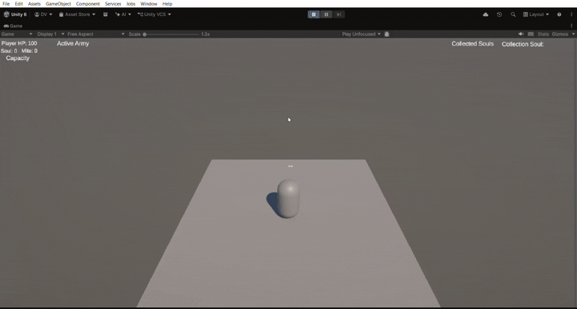

# Dang Anh Van — Game Engineer

*English | [Tiếng Việt](README.vi.md)*

Unity C# Gameplay Systems + Project Intelligence CLI

## About

This repository showcases two connected pieces of my work as a 
solo/indie game developer:

- **[`02-TWS-Lite`](./02-TWS-Lite)** — an early playable prototype of 
  *The Wone: Shadows*, an original action RPG built in Unity/C#, 
  centered on shadow summoning and army management.
- **[`01-DevOS-Lite`](./01-DevOS-Lite)** — a CLI tool I built to give 
  AI coding agents a single source of truth for a project, reducing 
  token usage and scope creep during development.

The Wone: Shadows is the core project. DevOS-Lite was built to solve 
a real bottleneck that came up while developing it.

## Demo

## Contact

Portfolio, project details available on request. contact email: danganhvan40@gmail.com